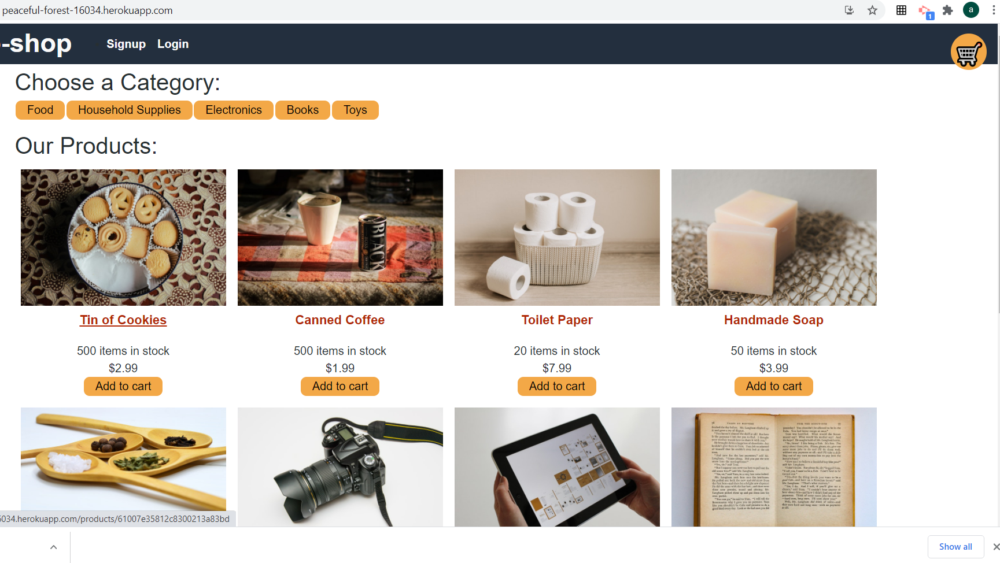

# Shop-shop
[](https://peaceful-forest-16034.herokuapp.com/)
  
[](https://opensource.org/licenses/mit)
  
## Description
a website using Redux
  
## Table of Contents
- [Installation](#installation)
- [Usage](#usage)
- [Screenshots](#screenshot)
- [Links](#links)
- [License](#license)
- [Questions](#questions)
  
## Installation
```md
npm install
```
  
## Usage
```md
navigate to website
```
  
## Screenshots


## Links
  https://peaceful-forest-16034.herokuapp.com/

  https://github.com/ashiemotto/shop-shop
## Reporting
```md
Github
```
## License
[](https://opensource.org/licenses/mit)
  
## Questions a
Add an issue through GitHub:
 https://github.com/Ashiemotto
  
Or using email:
Email: ashheadley@gmail.com

